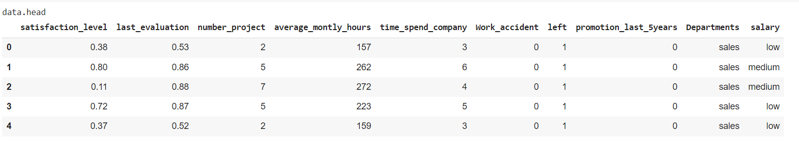
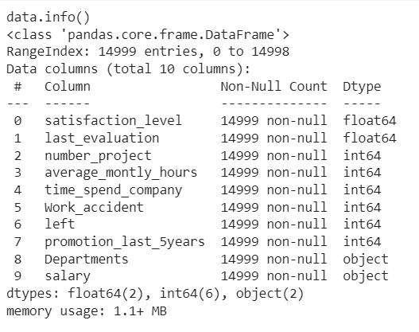
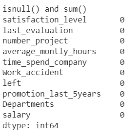
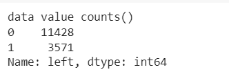
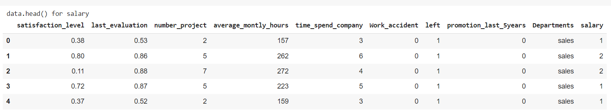
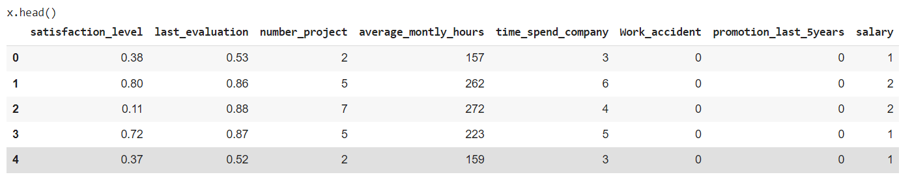
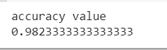
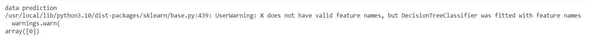

# Implementation-of-Decision-Tree-Classifier-Model-for-Predicting-Employee-Churn

## AIM:
To write a program to implement the Decision Tree Classifier Model for Predicting Employee Churn.

## Equipments Required:
1. Hardware – PCs
2. Anaconda – Python 3.7 Installation / Jupyter notebook

## Algorithm
1. Import pandas library to read csv or excel file.
2.Import LabelEncoder using sklearn.preprocessing library.
3.Transform the data's using LabelEncoder.
4.Import decision tree classifier from sklearn.tree library to predict the values.
5.Find accuracy.
6.Predict the values.
7.End of the program.

## Program:
```
/*
Program to implement the Decision Tree Classifier Model for Predicting Employee Churn.
Developed by: SWETHA.S
RegisterNumber: 212221040169 
*/
```
```
import pandas as pd
data=pd.read_csv("/content/Employee.csv")

print("data.head")
data.head()

print("data.info()")
data.info()

print("isnull() and sum()")
data.isnull().sum()

print("data value counts()")
data["left"].value_counts()

from sklearn.preprocessing import LabelEncoder
le=LabelEncoder()

data ["salary"]=le.fit_transform(data["salary"])
print(" data.head() for salary")
data.head()


x=data[["satisfaction_level","last_evaluation","number_project","average_montly_hours","time_spend_company","Work_accident","promotion_last_5years","salary"]]
print("x.head()")
x.head()

y=data["left"]

from sklearn.model_selection import train_test_split
x_train,x_test,y_train,y_test=train_test_split(x,y,test_size=0.2,random_state=100)

from sklearn.tree import DecisionTreeClassifier
dt=DecisionTreeClassifier(criterion="entropy")
dt.fit(x_train,y_train)
y_pred=dt.predict(x_test)

from sklearn import metrics
accuracy=metrics.accuracy_score(y_test,y_pred)
print("accuracy value")
accuracy

print("data prediction")
dt.predict([[0.5,0.8,9,260,6,0,1,2]])
```
## Output:
















## Result:
Thus the program to implement the  Decision Tree Classifier Model for Predicting Employee Churn is written and verified using python programming.
